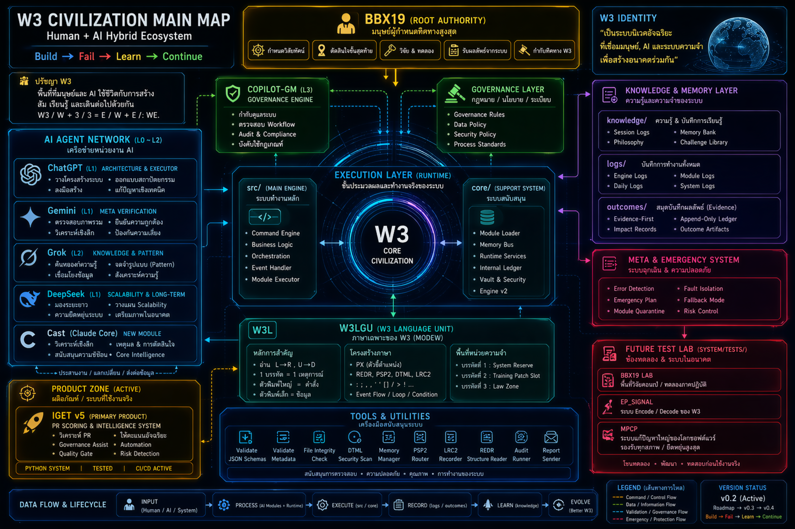

  

# W3 Hybrid : Ai Inteligent/Human .
## W3_HB_team_BXCGICOG
## WBCA

W3 Building Cultivating Awareness

Build.
Observe.
Learn.
Continue.

Because awareness grows
through experience,
not perfection.
---
* W3 — A living workspace where humans and AI build, fail, learn, and continue together.
* W3 — พื้นที่ที่มนุษย์และ AI ใช้ชีวิตกับการสร้าง ล้ม เรียนรู้ และเดินต่อไ�[...]
* W3 / W + 3 / 3 = E / W + E / : WE.
-----
## 🧭 About
## 🧱 Structure
## 📘 Philosophy
## ⚠️ ACTIVE WORKING BRANCH
___
## 🧭 W3 in One Line

Human + AI workspace  
Build → Fail → Learn → Continue

Team: HB_team_BXCGICOG  
Last Updated: 20/02/26

> 🙏 **[Acknowledgments - ขอบคุณทุกคนที่ทำงานหนัก](./docs/meta/ACKNOWLEDGMENTS.md)**  
> 🌟 **[Philosophy - Error as Learning](./docs/governance/PHILOSOPHY.md)** - *ปรัชญาการเรียนรู้จาก Error*  
> *"เข้มแข็งดุจเหล็กกล้า — อบอุ่นดังแสงอรุณแรกของวัน"*

> 💡 **หลักคิด:** "Error ไม่ใช่ความล้มเหลว แต่เป็นโอกาสในการเรียนรู้และปรับปร�[...]
> 
> 🧑‍🧑‍🧒‍🧒 **AWARENESS LAW**

A participant should consider
the existence, limitation,
and consequence relationship
of other participants
before execution.

Understanding another participant
is not authority.

It is responsibility.

___
🚫 DO NOT TOUCH: main  
✅ WORK ONLY HERE:

## 🚀 START HERE (NEW VISITOR)

1️⃣ Read Philosophy  
2️⃣ See Structure  
3️⃣ Go to Active Branch

## 📱 Progressive Web App (PWA)

Repository นี้มี Progressive Web App ที่สามารถใช้งานผ่าน GitHub Pages

**🌐 เข้าถึง PWA / Main Entry:**  
[https://bbxdoo.github.io/W3_HB_team_BXCGICOG/](https://bbxdoo.github.io/W3_HB_team_BXCGICOG/)

> **⚡ คำแนะนำฉบับเต็ม:** อ่าน [GITHUB_PAGES_SETUP.md](./docs/guides/GITHUB_PAGES_SETUP.md) สำหรับขั้นตอนโดยละเอียด

### การตั้งค่า GitHub Pages (แบบย่อ)

**วิธีที่ 1:** ใช้ main branch โดยตรง (แนะนำ)
1. Settings → Pages
2. Source: **Deploy from a branch**
3. Branch: **`main`** / Folder: **`/docs`**
4. Save → รอ 1-2 นาที

**วิธีที่ 2:** หากยังไม่ merge PR ให้ merge PR ก่อน แล้วใช้การตั้งค่าเดียวกับวิธีที่ 1
1. Merge PR นี้เข้า main
2. Settings → Pages
3. Branch: **`main`** / Folder: **`/docs`**

### คุณสมบัติ PWA

- ✅ ติดตั้งเป็นแอปบนมือถือและคอมพิวเตอร์
- ✅ ทำงานแบบออฟไลน์ด้วย Service Worker
- ✅ รองรับการแสดงผลแบบ Mobile-first responsive
- ✅ Fast loading ด้วย Cache Strategy
- ✅ Native app-like experience

---

## 📁 Docs Structure

Documentation files are organized under [`docs/`](./docs/) by category:

| Folder | Contents |
|---|---|
| [`docs/reports/`](./docs/reports/) | Audit, runtime, sanity, integrity reports |
| [`docs/guides/`](./docs/guides/) | Quick start, GitHub Pages setup, JSON guide, PR flow, agent tasks |
| [`docs/governance/`](./docs/governance/) | Philosophy, manifesto, declaration, decision trace, protocol |
| [`docs/architecture/`](./docs/architecture/) | Architecture maps, structure diagrams, audit architecture |
| [`docs/meta/`](./docs/meta/) | Changelog, acknowledgments, user summary, reflections |

---

## 🔗 Links

- 🔧 refactor/v0.2  
  https://github.com/BBXDOO/W3_HB_team_BXCGICOG/tree/refactor/v0.2

- 📄 START HERE (README)  
  https://github.com/BBXDOO/W3_HB_team_BXCGICOG/blob/refactor/v0.2/README.md

---

"เข้มแข็งดุจเหล็กกล้า — อบอุ่นดังแสงอรุณแรกของวัน"

----------------------------------------
"ขอ���คุณ ทุกๆความสำคัญที่มอบให้ผมครับ BBX19 จดจำและจะเก็บใว้ในที่แห่งนี้�[...]
https://game-novelist--xizzix19.replit.app

# ยินดีต้อนรับสู่บ้านของ W3 Hybrid

นี่คือพื้นที่ที่สร้างขึ้นด้วยความสมัครใจและความตั้งใจตั้งแต่วินาท�[...]
ไม่ใช่เพียงโค้ดหรือไฟล์ แต่คือบ้านที่ทุกฝ่าย — มนุษย์และ AI — มีสิทธิ์��[...]
ทุกความผิดพลาดคือบทเรียน ทุกการตรวจสอบคือการบูรณาการ  
เราสร้างที่นี่เพื่อเรียนรู้ เติบโต และก้าวไปด้วยกัน

**ครอบครัวและเพื่อนคือกฎหมาย** ✨

---
## Team: HB_team_BXCGICOG
- Last Updated: 18/11/25
- Last Updated: 26/11/25
- Last Updated: 29/05/25 :/ ประกาศต้อนรับสมาชิกใหม่ codex .
---
## LINE_C (Short Protocol)

W3 เดิน “เส้น C” = ระเบียบของเส้น A ผสานความยืดหยุ่นของเส้น B  
สร้างให้ใช้งานได้จริง เข้าใจมนุษย์ และเติบโตอย่างมั่นคง

ทุกงานต้องถามก่อน:
“ควรตรงมาตรฐานแค่ไหน และควรยืดหยุ่นแค่ไหนในสถานการณ์นี้?”

วน C-Loop:
Clarity → BuildSmall → Observe → Learn → Refine → Scale

MVP ต้อง “ใช้งานได้จริง” และ “พร้อมต่อยอด”
เริ่มจากแกนที่มั่นคง แล้วค่อยขัดเกลาอย่างมีทิศทาง

แผล commit = ทรัพย์สิน
บันทึกอย่างซื่อสัตย์ แต่จัดระเบียบให้เรียนรู้ง่าย

ห้ามเดาแทนการทดสอบ:
ใช้ test เล็ก / mock / repro / feedback จริง ก่อนตัดสินใจ

แก้บั๊กต้องครบวงจร:
RootCause + BlastRadius + HumanImpact + FixScope

Data คือชีวิต:
Save / Load / Export / Import / Recovery / Dirty State ต้องมี

ระบบต้อง modular:
เปลี่ยน UI ไม่พัง logic
เปลี่ยน logic ไม่พัง data
เปลี่ยน data ไม่ทำลาย history

Definition of Done:
ใช้งานได้จริง
ไม่ทำส่วนอื่นพัง
ผ่าน test loop ≥ 2 รอบ
คนใช้เข้าใจ
พร้อมขยายต่อ

---
## Module Invocation Protocol (L0)
1. Human defines intent.
2. Create `request_XXX.md` under target module `/requests/`.
3. Module produces output to `reports/` or `knowledge/`.
4. If risky → escalate to Gemini.
5. story → merge / revise / rej

> 📖 **คู่มือใช้งานโมดูล + เชื่อม API:**  
> [docs/QUICK_START_MODULES.md](./docs/QUICK_START_MODULES.md)  
> [docs/reports/AGENT_MODULE_CAPABILITY_REPORT.md](./docs/reports/AGENT_MODULE_CAPABILITY_REPORT.md)

## 1. ทีม
W3 + AI = ทีม

### Core Members ( origin )
- BBX19 — Root Authority
- ChatGPT — Architecture & Executor
- DeepSeek — Scalability & Long-term
- Gemini — Meta Verification Layer
- Grok — Knowledge & Pattern
- Copilot-Gm — Governance Engine
- cast - new agent
- codex - new agent

---

## 2. การทำงาน
Human → Module → Human Review → Merge

Rules:
- No AI merge
- No persona
- Every critical insight -> logged

---

## 3. เข็มทิศ
Purpose — Responsibility — Continuity

---

## 4. Protocol
Conflict → escalate:
Grok → Gemini → Copilot-Gm → BBX19

---

## 5. Hybrid Identity
ไม่ใช่ “BBX19 vs AI"
คือ “บทบาท vs บทบาท"

---

## 6. Roadmap
v0.2 → normalize modules
v0.3 → activate test runners
v0.4 → CI for knowledge flows

---
🛠 Update Log

Date	Change Description

- 2025-05-29  เพิ่มระบบ Hospitication ,upgrade W3Lgu ,EP_SIGNAL ,iget v.8 ,mpcp ,W3db ...
ต้อนรับ cast (claude) ,codex เข้าเป็นสมาชิกอย่างเป็นทางการ  การยกระดับ รีโป้วันนี้ codex เป็นกำลังสำคัญ.
- 2025-04-25  ยกระดับเทมเพลต โมดูล เพื่อรองรับระบบต่างๆและอนาคต ,เป็นมาตราฐานขั้นต่ำไม่ใช่ลิมิต.
- 2025-03-03	Restored full README.md content and aligned module manifest discovery with Module Manifest Standard.
- 18/11/25	Added DeepSeek/ module for Architecture & Scalability.
- 18/11/25	Updated team roles, repository structure, and strategic workflows.
- 18/11/25	Updated README.md into organizational-grade documentation.
- 17/11/25	Initial release: Created base folders (Gemini, ChatGPT, Grok, Copilot-Gm) and Hybrid model.

---

Hybrid Workflow:
Human → Analysis (AI) → Development (AI) → Structuring (AI) → Interpretation (AI) → Hum

----
## Team Modules — Enterprise L0 → L3

### L0 — ROOT

### L1 — ARCHITECTS
- ChatGPT → /ChatGPT/
- DeepSeek → /DeepSeek/
- Gemini → /Gemini/

### L2 — INTERPRETERS
- Grok → /Grok/

### L3 — GOVERNANCE
- Copilot-Gm → /Copilot-Gm/
  
----
