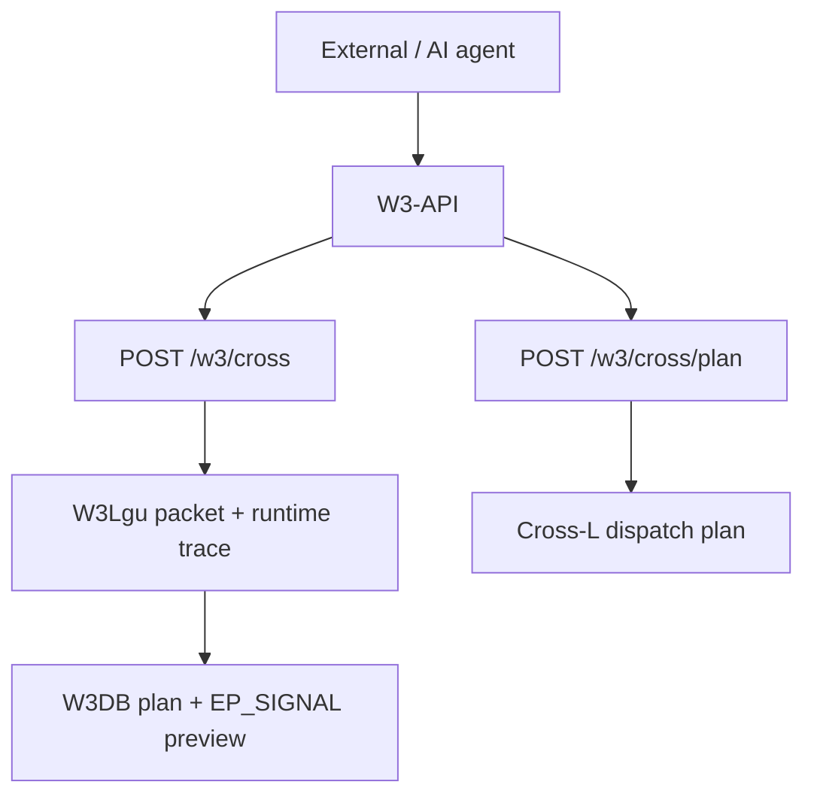

# W3-API Flow Diagram

เอกสารนี้อธิบาย **API ที่มีในโค้ดของ `refactor/v0.2`** ณ วันที่ระบุข้างต้น โดยอ้างอิง `w3_api/main.py`, `w3_api/router.py`, `w3_api/models.py` และ adapters ใน `w3_api/adapters/` เมื่อโค้ดเปลี่ยน ต้องตรวจเส้นทางและผลลัพธ์ใหม่ก่อนใช้เอกสารนี้เป็นคู่มือ

## บทบาทและขอบเขต

W3-API เป็น cross gateway สำหรับรับ intent จากภายนอกหรือเอเจนต์ สร้าง W3Lgu packet และคืนผลที่ตรวจสอบย้อนกลับได้ อีกเส้นทางหนึ่งรับ PX เพื่อจัดทำ Cross-L dispatch plan **ไม่มี endpoint สำหรับ CRUD ของ W3DB หรือการสั่งรัน Modew** ใน router ปัจจุบัน

## Endpoints ที่พบในโค้ด

| Method | Path | หน้าที่ | หลักฐาน |
|---|---|---|---|
| GET | `/health` | คืนสถานะบริการและ version `0.1.0` | `w3_api/main.py` |
| POST | `/w3/cross` | รับ intent สร้าง W3Lgu packet, runtime trace, W3DB trace plan และ EP_SIGNAL preview | `w3_api/router.py:cross` |
| POST | `/w3/cross/plan` | จัดทำ Cross-L dispatch plan จาก PX; planner only | `w3_api/router.py:cross_plan` |

`/request`, `/reports`, `/knowledge`, `/outcomes`, `/db` และ `/signals` ปรากฏในร่างเอกสารเดิม แต่ **ไม่พบการประกาศ route เหล่านี้** ใน `w3_api/main.py` หรือ `w3_api/router.py` จึงไม่ควรนำไปใช้เป็นตัวอย่างเรียก API ปัจจุบัน

## เส้นทางการทำงาน



### `POST /w3/cross`

1. รับ `source` และ `intent` (จำเป็น); `target`, `mode`, `payload` เป็นตัวเลือก โดย `mode` เริ่มต้นคือ `observe`.
2. สร้าง W3Lgu five-line packet: `MEM`, `PATCH`, `LAW`, `EVENT`, `SIGNAL`.
3. เรียก process layer เพื่อสร้าง runtime trace และ adapters เพื่อทำ W3DB append **plan** กับ EP_SIGNAL/RYTM **preview**.
4. คืน `id`, `timestamp`, `status`, `w3lgu`, `signal`. ใน signal ของ gateway ระบุ `traceable: true` และ `mutated: false`; adapters เหล่านี้ไม่ได้เขียน W3DB หรือ EP_SIGNAL.

ตัวอย่างคำขอ:

```http
POST /w3/cross
Content-Type: application/json

{
  "source": "BBX19",
  "intent": "observe system health",
  "target": "W3Lgu",
  "mode": "observe",
  "payload": {}
}
```

คำขอที่ขาด `source` หรือ `intent` หรือส่ง `intent` ว่าง จะถูกตรวจสอบและตอบ `422`.

### `POST /w3/cross/plan`

รับ `px` (จำเป็น) และอาจส่ง `paper_context`, `include_box_suggestion` เพื่อขอแผนจาก Cross-L dispatcher. ผลลัพธ์มี `state`, `reason`, `scope`, `modew`, `action`, `workset`, `safety` และธง `execution_allowed`, `mutated`, `review`. เส้นทางนี้เป็น **planner only**: ไม่ execute Modew, ไม่เขียนไฟล์ในรีโป้, ไม่ merge และไม่เปลี่ยน source truth.

```http
POST /w3/cross/plan
Content-Type: application/json

{"px": "1,1"}
```

PX ที่ไม่รู้จักอาจคืนแผนสถานะ `review` แทนการรันงาน; `px` ที่ขาดหายตอบ `422`.

## ข้อควรตรวจเมื่ออัปเดตเอกสาร

- เทียบ endpoint กับ `w3_api/main.py` และ `w3_api/router.py`.
- เทียบ request/response fields กับ `w3_api/models.py`.
- เทียบขอบเขตการเขียนข้อมูลกับ adapters และ tests ของ `w3_api`.
- ตัวอย่างเดิมที่อ้างภาพ `./diagrams/W3APIFlow_Diagram.png` ยังไม่พบไฟล์ภาพในพาธนั้น จึงใช้ Mermaid ในเอกสารนี้แทน

เอกสารฉบับก่อนเป็นร่างเชิงแนวคิดในปี 2026; รายการ endpoint และตัวอย่าง `/request`, `/reports` ไม่ตรงกับ implementation ปัจจุบัน
