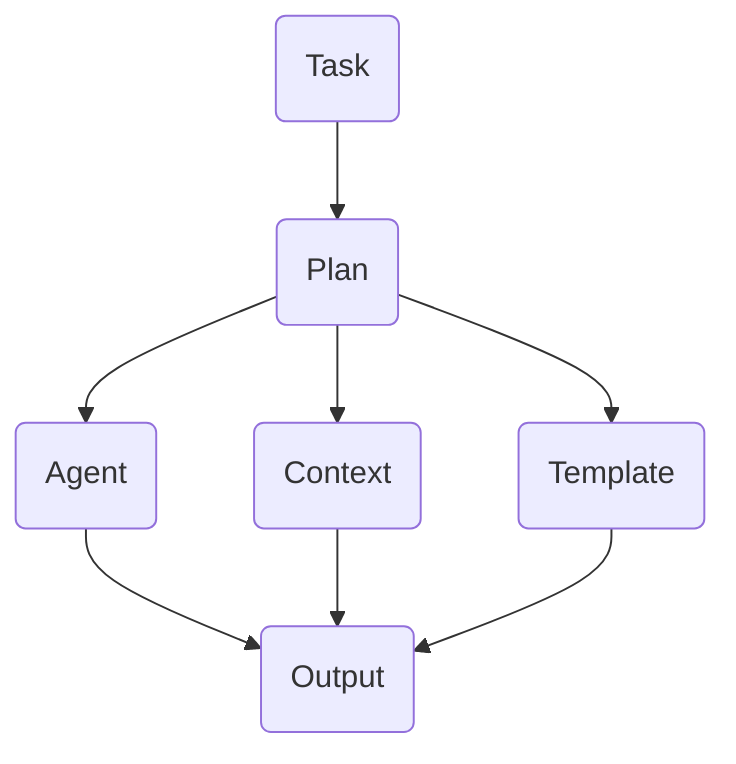

# แปลด้วยความเข้าใจ
- ระบบใด ๆ ก็อ่านเข้าใจ/นำไปปรับใช้ในโปรเจกต์ตัวเองได้  
- ทุกคนปรับเองหรือขยายใช้ได้เลยในแต่ละองค์กร/ทีม  
- เน้นคำอธิบายสากล ตัวอย่างต้องปรับเข้ากับ software engineering หรือระบบ agent-based workflow

---

````markdown name=knowledge/philosophy/README.md
# ปรัชญาระบบ (Philosophy for Agent-Based/Knowledge-Driven Systems)

## วัตถุประสงค์ (Purpose)

เพื่อเป็นสมุดแนวทางและหลักคิดกลาง ที่ใช้เชื่อมต่อทีม/ระบบ/องค์กรต่าง ๆ 
สำหรับการออกแบบและการพัฒนาระบบทำงานร่วมกัน (Collaborative System) เช่น Agent-based, Workflow-based, Knowledge System  
เนื้อหาในโฟลเดอร์นี้สื่อสารด้วยภาษาเข้าใจง่ายสากล นำไปประยุกต์ใช้ได้ทันที ไม่ว่าคุณจะอยู่ในวงการใด

---

## แนวคิดหลัก (Key Philosophies)

### 1. **แยกบทบาท (Separation of Concerns)**
แบ่ง "หน้าที่" (Role/Responsibility) ของแต่ละองค์ประกอบของระบบออกจากกันอย่างชัดเจน  
เช่น Agent, Plan, Context, Document, Output  
> **ตัวอย่าง:**  
> - Agent แต่ละตัวรับผิดชอบงานเฉพาะด้าน
> - Context แยกข้อมูลผู้ใช้ แผน/Task อยู่ใน Plan อย่างเดียว

---

### 2. **ยืดหยุ่นและนำกลับมาใช้ซ้ำ (Reusability & Flexibility)**
ทุกองค์ประกอบควรออกแบบให้ "reuse ได้" โดยเปลี่ยนหรือต่อกันใหม่ได้ทันที  
> **ตัวอย่าง:**  
> - สามารถเปลี่ยน Agent, เปลี่ยน Template ได้ โดยไม่ต้องแก้จุดอื่น  
> - เอกสารแผนงานใช้กับระบบอื่นได้ทันที

---

### 3. **ทำงานร่วมกัน (Interoperability)**
ใช้ "รูปแบบการสื่อสาร" (Protocol/API/Template) ที่ทำให้ระบบ/ทีมต่างกัน สามารถคุยกันได้  
> **ตัวอย่าง:**  
> - Template File, Markdown, JSON, OpenAPI ฯลฯ

---

### 4. **โปร่งใส (Transparency)**
ทุกขั้นตอนควร “เข้าใจง่าย/ตรวจสอบย้อนกลับได้”  
> **ตัวอย่าง:**  
> - ทุก Task มี Plan, Context, Agent ทุกตัววางโครงสร้างไว้ชัดเจน  
> - ใช้ log tracking/commit

---

### 5. **ขยายผล (Extensibility)**
ระบบต้องเสริมขยายได้ ไม่ block นวัตกรรม  
> **ตัวอย่าง:**  
> - เพิ่ม Agent ใหม่ เสริม Plan template ใหม่ ได้

---

## แนวทางปฏิบัติ (Best Practices)

- ศัพท์เทคนิค (เช่น Plan, Context, Agent, Usecase, Testcase) ต้องมี Glossary แนบ
- การออกแบบและสื่อสาร ควรใช้ **ตัวอย่าง (Example)** เสมอ  
- ก่อน implement หรือปรับระบบ ให้เริ่มจาก Usecase (ตัวอย่างการใช้งานจริง)  
- ทุก Agent/โมดูลควรแยก Testcase (ชุดทดลองใช้งานจริง) ไว้เสมอ

---

## โครงสร้างไฟล์ที่แนะนำ (Example File Structure)

- **README.md**        — เกริ่นและสรุปแนวคิด
- **Glossary.md**      — ศัพท์เทคนิคและคำย่อ พร้อมคำอธิบาย
- **Usecase.md**       — ตัวอย่างสถานการณ์/การนำไปใช้
- **BestPractice.md**  — ตัวอย่างปฏิบัติที่วิเคราะห์แล้วได้ผลดี
- **DesignPattern.md** — รูปแบบการออกแบบที่นิยม (เช่น Agent pattern, Command pattern)
- **Contribution.md**  — วิธีเพิ่ม/ขยายความรู้/โครงสร้างให้ระบบ

---

## ตัวอย่างการเชื่อมโยง (Example Interconnection)



---

## License/ข้อกำหนด

เนื้อหาในหมวดนี้สามารถใช้งาน ปรับขยาย และแชร์ต่อในวงการ/ชุมชนใดๆ ได้เสรี  
(ขอแค่ให้เครดิต, แชร์แบบเปิด และอ้างอิงแหล่งที่มา)

---

## Contributor/ผู้เขียน

- [BBXDOO/W3_HB_team_BXCGICOG](https://github.com/BBXDOO/W3_HB_team_BXCGICOG)
- Contributor อื่นๆ เพิ่มเติม (ระบุเพิ่มได้)
````

---

**ข้อแนะนำ:**  
- เพิ่มเติมไฟล์หัวข้อย่อย (เช่น Glossary.md, Usecase.md) ได้ใน knowledge/philosophy/  
- ใน README.md ควรมีสรุป “หลักคิดกลาง”– เทคนิค/ตัวอย่าง/แผนผัง  
- ใครก็ clone ไปต่อ/ดัดแปลงกับระบบตัวเองได้  
- ภาษาไทยควบกับอังกฤษ อ่านง่าย นำไปสื่อสารกับทีมต่างประเทศได้  
- โครงสร้างนี้ “ให้ภาพกว้าง” ทันทีว่าระบบ agent/plan/context/blueprint เชื่อมกันยังไง

---

## ทักษะที่สามารถประยุกต์ใช้ได้กับคนทุกระดับ ,ภาษา.
